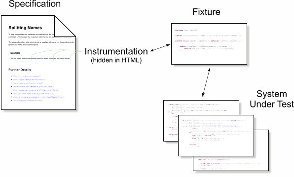

# The Basics

An executable specification consists of two parts: (i) a specification describing the functionality, and (ii) fixture code which executes the system under test.

In order for the magic to happen, the document must first be _instrumented_ with commands. The instrumentation is invisible to a browser, but is processed by the fixture code.

The format of the instrumentation depends on the format of the specification:

<ul class="collapsible collapsible-accordion" data-collapsible="accordion">
  <li>
    
<i class="mdi mdi-markdown"></i>Markdown

    

        
Markdown specifications use links:

        <pre><code class="markdown">
When [Bob](- "#firstName") logs in 
a greeting [Hello Bob!](- <b>"?=greetingFor(#firstName)"</b>) should be displayed.
        </code></pre>
    

</li>
  <li>
    
<i class="mdi mdi-code-tags"></i>HTML

    

        
HTML specifications use attributes:

        <pre><code class="html">
&lt;p>
    When &lt;<b>span concordion:set="#firstName"</b>>Bob&lt;/span> logs in a greeting
    &lt;span <b>concordion:assert-equals="greetingFor(#firstName)"</b>>Hello Bob!&lt;/span>
    should be displayed.
&lt;/p>        
        </code></pre>
    

</li>
</ul>

The common theme is that the instrumentation is effectively invisible when the specification is previewed. The Markdown format has the added benefit that you can hover over the link to see the instrumentation.

{::options parse_block_html="true" /}

  <ul class="tabs">
    <li class="tab col s3"><a href="#markdown"><i class="mdi mdi-markdown"> </i>  Markdown</a></li>
    <li class="tab col s3"><a href="#html"><i class="mdi mdi-code-tags"></i>  HTML</a></li>
  </ul>





 <!-- html -->

 <!-- row -->

# Commands

Concordion has a purposefully small command set to make it easy to learn and use. 

The full command set in Concordion core is:

| Command | Description |
| --------------- | --------------- |
| example | marks a section of the specification as being a named example. Each example is run as a separate test by the test runner. |
| set | sets a specification variable to a text value |
| execute | executes code in the fixture, optionally setting a specification variable with the return value |
| assert-equals | evaluates an expression and asserts the result against a text value |
| verify-rows | compares the contents of a table with the contents of a collection |
| run | runs a linked specification |
| assert-true | evaluates an expression and asserts the result is true |
| assert-false | evaluates an expression and asserts the result is false |
| echo | evaluates an expression and inserts the result into the output HTML |

If needed, additional commands can be implemented as [extensions][TODO].
 
TODO - add details of IDEA and Eclipse extensions to instrumentation.md when available..

These are the essential features of Concordion and should be all you need to get started. Read the page on Technique for advice on the approach to writing the specifications, or see below if you wish to look at advanced features.